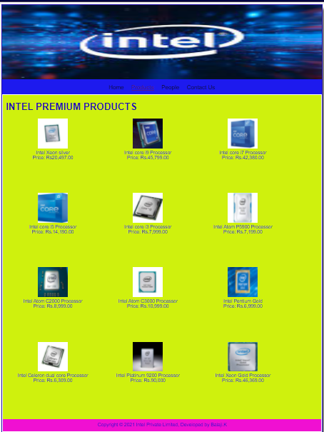

# Web Design for a Software Product Company

## AIM:

To design a static website for a software product company company.

## DESIGN STEPS:

### Step 1:

Requirement collection.

### Step 2:

Creating the layout using HTML and CSS.

### Step 3:

Updating the sample content.

### Step 4:

Choose the appropriate style and color scheme.

### Step 5:

Validate the layout in various browsers.

### Step 6:

Validate the HTML code.

### Step 6:

Publish the website in the given URL.

## PROGRAM :
```
Home Page:

 <!DOCTYPE html>
<html lang="en">
  <head>
    <title>Beekay Spares Private Limited</title>
    <link rel="stylesheet" href="./css/layout.css" />
    <link rel="icon" href="./img/icon.png" type="image/x-icon" />
  </head>

  <body>
    <div class="container">
      <div class="banner"></div>
      <div class="menu">
        <div class="menuitemselected"><a href="/static/home.html">Home</a></div>
        <div class="menuitem"><a href="/static/products.html">Products</a></div>
        <div class="menuitem"><a href="/static/people.html">People</a></div>
        <div class="menuitem"><a href="/static/contact Us.html">Contact Us</a></div>
      </div>
      <div class="content">
        <div class="homecontent">
          <h1>ABOUT INTEL</h1>
          
          <div class="contenttext">
            Intel is best known for developing the microprocessors found in most of the world's personal computers.
            <br> 
            Intel also manufactures graphics chips, flash memory, motherboard chipsets, and other computing devices.
            
            
            
            
            <br />
            Intel chips are some of the most complex devices ever manufactured, requiring advanced manufacturing technology.
            
            <br>
            Intel, in full Intel Corporation, American manufacturer of semiconductor computer circuits. 
            <br> 
            
            
            
            
            
            
            
            <ul>
              <li>Quality is our priority</li>
              <li>If it is smart and connected, it is best with Intel</li>
              <li>Anywhere, anytime and secure access</li>
            </ul>
          </div>
        </div>
      </div>
      <div class="footer">
        Copyright &#169; 2021 Intel Private Limited, Developed by Balaji.K
      </div>
    </div>
  </body>
</html>


Products Page:

<!DOCTYPE html>
<html lang="en">
  <head>
    <title>Beekay Spares Private Limited</title>
    <link rel="stylesheet" href="./css/layout.css" />
    <link rel="icon" href="./img/icon.png" type="image/x-icon" />
  </head>

  <body>
    <div class="container">
      <div class="banner"></div>
      <div class="menu">
        <div class="menuitem"><a href="/static/home.html">Home</a></div>
        <div class="menuitemselected">
          <a href="/static/products.html">Products</a>
        </div>
        <div class="menuitem"><a href="/static/people.html">People</a></div>
        <div class="menuitem"><a href="/static/contact Us.html">Contact Us</a></div>
      </div>
      <div class="content">
        <div class="productcontent">    
          <h1>INTEL PREMIUM PRODUCTS</h1>
          <div class="productitems">
              <div class="productitem"> 
                  <div class="itemimage">
                  
                  </div>
                  <div class="itemname">Intel Xeon silver</div>
                  <div class="itemprice">Price: Rs20,497.00 </div>
              </div>
              <div class="productitem"> 
                  <div class="itemimage">
                  
                  </div> 
                  <div class="itemname">Intel core i9 Processor</div>
                  <div class="itemprice">Price: Rs.45,799.00 </div>
              </div>
              <div class="productitem"> 
                <div class="itemimage">
                
                </div>
                <div class="itemname">Intel core i7 Processor</div>
                <div class="itemprice">Price: Rs.42,380.00 </div>
              </div>
              <div class="productitem"> 
                <div class="itemimage">
                
                </div>
                <div class="itemname">Intel core i5 Processor</div>
                <div class="itemprice">Price: Rs.14,190.00 </div>
              </div> 
              <div class="productitem"> 
                <div class="itemimage">
                
                </div>
                <div class="itemname">Intel core i3 Processor</div>
                <div class="itemprice">Price: Rs.7,999.00 </div>
              </div>
              <div class="productitem"> 
                <div class="itemimage">
                
                </div>
                <div class="itemname">Intel Atom P5900 Processor</div>
                <div class="itemprice">Price: Rs.7,199.00 </div>
              </div> 
              <div class="productitem"> 
                <div class="itemimage">
                
                </div>
                <div class="itemname">Intel Atom C2000 Processor</div>
                <div class="itemprice">Price: Rs.8,999.00 </div>
              </div> 
              <div class="productitem"> 
                <div class="itemimage">
                
                </div>
                <div class="itemname">Intel Atom C3000 Processor</div>
                <div class="itemprice">Price: Rs.10,999.00 </div>
              </div>  
              <div class="productitem"> 
                <div class="itemimage">
                
                </div>
                <div class="itemname">Intel Pentium Gold</div>
                <div class="itemprice">Price: Rs.6,999.00 </div>
              </div>
              <div class="productitem"> 
                <div class="itemimage">
                
                </div>
                <div class="itemname">Intel Celeron dual core Processor</div>
                <div class="itemprice">Price: Rs.6,309.00 </div>
               </div>
               <div class="productitem"> 
                <div class="itemimage">
                
                </div>
                <div class="itemname">Intel Platinum 9200 Processor</div>
                <div class="itemprice">Price: Rs.90,000 </div> 
               </div>
               <div class="productitem"> 
                <div class="itemimage">
                
                </div>
                <div class="itemname">Intel Xeon Gold Processor</div>
                <div class="itemprice">Price: Rs.46,369.00 </div>  
               


          </div>
          </div>        
      </div>
      <div class="footer">
        Copyright &#169; 2021 Intel Private Limited, Developed by Balaji.K
      </div>
    </div>
  </body>
</html>


People Page:

<!DOCTYPE html>
<html lang="en">
  <head>
    <title>Beekay Spares Private Limited</title>
    <link rel="stylesheet" href="./css/layout.css" />
    <link rel="icon" href="./img/icon.png" type="image/x-icon" />
  </head>

  <body>
    <div class="container">
      <div class="banner"></div>
      <div class="menu">
        <div class="menuitem"><a href="/static/home.html">Home</a></div>
        <div class="menuitem"><a href="/static/products.html">Products</a>
        </div>
        <div class="menuitemselected"><a href="/static/People.html">People</a></div>

        <div class="menuitem"><a href="/static/Contact us.html">Contact Us</a></div>
      </div>
      <div class="content">
        <div class="productcontent">    
          <h1>INTEL MEMBERS</h1>
          <div class="productitems">
              <div class="productitem"> 
                  <div class="itemimage">
                  
                  </div>
                  <div class="itemname">Mr.BALAJI.K</div>
                  <div class="itemprice">CEO </div>
              </div>

              <div class="productitem"> 
                <div class="itemimage">
                
                </div>
                <div class="itemname">Mr.CHRIS</div>
                <div class="itemprice"> GENERAL MANAGER </div>
            </div>
            <div class="productitem"> 
              <div class="itemimage">
              
              </div>
              <div class="itemname">Mr.SUNDAR</div>
              <div class="itemprice">SALES MANAGER</div>
          </div>
          <div class="productitem"> 
            <div class="itemimage">
            
            </div>
            <div class="itemname">Mr.JOHN </div>
            <div class="itemprice">TEAM LEADER</div>
        </div>
        <div class="productitem"> 
          <div class="itemimage">
          
          </div>
          <div class="itemname">Mr.TONY</div>
          <div class="itemprice">PRODUCTION MANAGER</div>
      </div>
      <div class="productitem"> 
        <div class="itemimage">
        
        </div>
        <div class="itemname">Mr.ELON</div>
        <div class="itemprice">PLAN EXECUTOR</div>
    </div>
              </div>
              <div class="footer">
                Copyright &#169; Intel Private Limited, Developed by K.Balaji
            
              </div>    
              
          </div>
          </div>        
      </div>
      

    </div>
  </body>
</html>


Contact Us Page:

<!DOCTYPE html>
<html lang="en">
  <head>
    <title>BeeKay Spares Private Limited </title>
    <link rel="stylesheet" href="./css/layout.css" />
    <link rel="icon" href="./img/icon.jpg" type="image/x-icon" />
  </head>

  <body>
    <div class="container">
        <div class="banner"></div>

      <div class="menu">
        <div class="menuitem"><a href="/static/home.html">Home</a></div>
        <div class="menuitem"><a href="/static/products.html">Products</a>
        </div>
        <div class="menuitem"><a href="/static/People.html">People</a></div>

        <div class="menuitemselected"><a href="/static/Contact us.html">Contact Us</a></div>
      </div>
      <div class="content">
    
        <div class="content">
          <div class="homecontent">
          
            
        
        <br>25A/27,Muthaiya nagar,</br>
        <br>Thirupapuliyur</br>
        <br>Cuddalore-2</br>
        <br>Phone: 044-48475 43485</br>
        <br>Email-intelcorp2004@gamil.com</br>
      </div>

      </div>
          </div>
          </div>        
      </div>
      <div class="footer">
        Copyright &#169; 2021 Intel Private Limited, Developed by Balaji.K
      </div>
    </div>
  </body>
</html>


```
## OUTPUT:

### Home Page:


### Products Page:

### People Page:

### Contact Us Page:


## Result:

Thus a website is designed for the software product company and the HTML,CSS code are validated.
